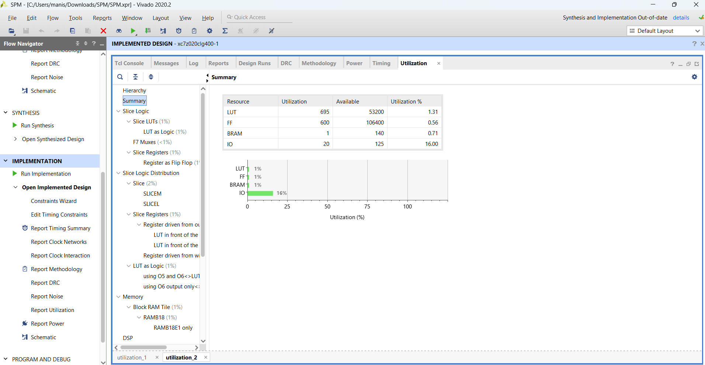
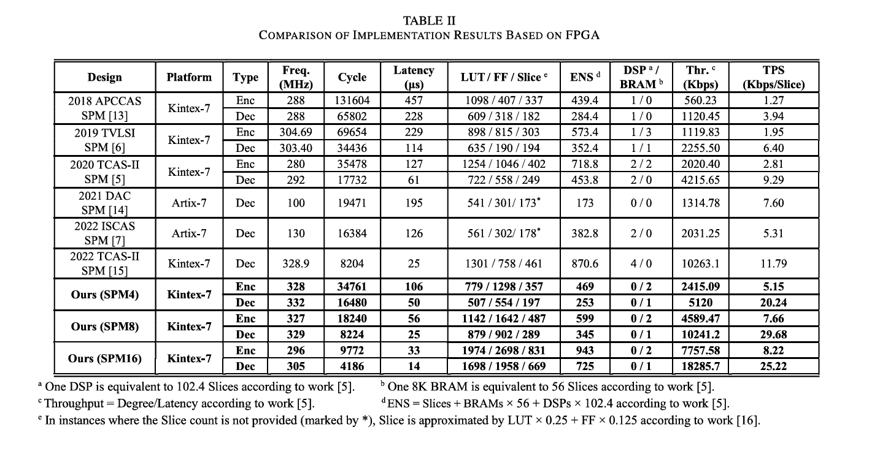
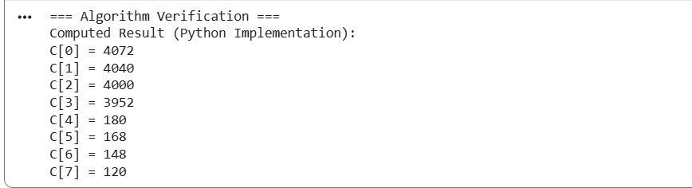
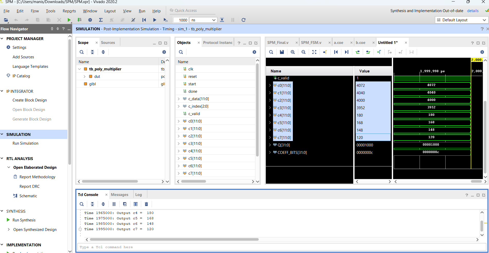

# SPM-Implementation

SPM Algorithm Hardware Implementation (Vivado)

This repository contains an FPGA-based implementation of the SPM algorithm as proposed in the paper  
**[“A Lightweight and Efficient Encryption/Decryption Coprocessor for RLWE-Based Cryptography”](https://ieeexplore.ieee.org/document/10659211)**  
published by IEEE. The design is developed, synthesized, and implemented using Xilinx Vivado, targeting post-implementation timing and resource analysis.

---

## Main Updated RTL File

The latest and most stable implementation of the SPM algorithm:

**[`SPM_Final.v`](SPM.srcs/sources_1/new/SPM_Final.v)**

This file contains the final optimized architecture with all recent updates.

---

## Memory Initialization Files

- **RAM1 (a-coefficients, two per address)**  
  [`RAM1.coe`](SPM.srcs/sources_1/ip/blk_mem_gen_0/a.coe)

- **RAM2 (b-coefficients, four per address with SPM rotations)**  
  [`RAM2.coe`](SPM.srcs/sources_1/ip/blk_mem_gen_1/b.coe)

---

## Polynomials Used (n = 8)

\[
A(x) = 1 + 2x + 3x^2 + 4x^3 + 5x^4 + 6x^5 + 7x^6 + 8x^7
\]

\[
B(x) = 1 + 2x + 3x^2 + 4x^3 + 5x^4 + 6x^5 + 7x^6 + 8x^7
\]

---

## Vivado Results and Comparison

### Resource Utilization (Post-Implementation)

### SPM-8 Paper Comparison

### Output Verification (Python vs Hardware)

$readmemb("reports/simulation/a.mem", mem_a);
$readmemb("reports/simulation/b.mem", mem_b);
